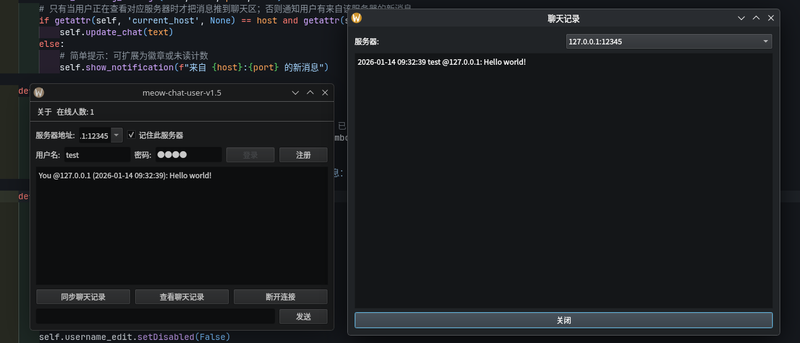
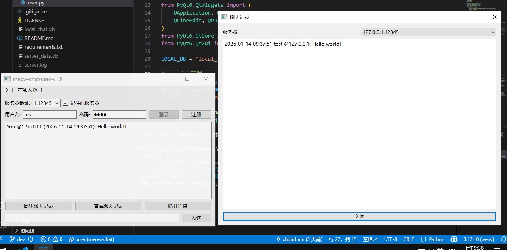

# Meow-Chat：一个简单的通讯工具
<div>
    <a href="https://github.com/xhdndmm/meow-chat/stargazers"></a>
    <a href="https://github.com/xhdndmm/meow-chat/blob/main/LICENSE"></a>
    <a href="https://www.python.org/download"></a>
    <a href="https://github.com/xhdndmm/meow-chat/releases"></a>
</div>
  
------

- 运行环境：Archlinux+Plasma  


- 运行环境：Windows10 22H2  

------

## 它是什么？
这是一个简单的通讯工具，使用Python编写，SQLite作为数据库，PyQt6图形化，AES加密，自带服务端和客户端验证。
## 如何使用？
在[这里](https://github.com/xhdndmm/meow-chat/releases)下载二进制包，运行即可。
- 服务端需要开放12345端口
### 服务器配置文件说明
```json
{
  "host": "0.0.0.0",
  "port": 12345,
  "db_path": "server_data.db",
  "log_file": "server.log",
  "log_level": "INFO"
}
```
- `host`：监听地址
- `port`：监听端口
- `db_path`：数据库地址
- `log_file`：日志地址
- `log_level`：日志级别
## 问题&开发
程序不可避免存在BUG，你可以在[这里](https://github.com/xhdndmm/meow-chat/issues)反馈  
我们很欢迎你来为本程序添砖加瓦，但是请遵守以下规则：
- 在提交PR之前，**请务必测试或审查**！确保你提交的程序没有严重错误。
- 提交PR时，请提交到dev分支。
- 建议使用[VSCode](https://code.visualstudio.com/)作为编辑器 不过不强求（VSCode有调试文件）
## 使用协议
本程序使用[GPLv3](./LICENSE)协议，请遵守